# スペクトログラム一覧 (encoder × vocoder = 24)

同一テキスト **「おはようございます、こんにちは、こんばんは、おやすみなさい。」** を、
全 **6 encoder × 4 vocoder = 24 通り**で合成した mel→audio の STFT スペクトログラム
(CPU, fp16, magma, dB, 0–11kHz)。各サムネイルは**クリックで mp4(音声 + 時間を示すシアンの縦棒)を再生**(原寸 PNG は `docs/wav/<combo>.png`)。
ブラウザで開ける HTML 版は [docs/index.html](docs/index.html)、最小構成のデモは [README](README.md)。

生成: [`tools/gen_demos.py`](tools/gen_demos.py) の描画関数(synth → STFT → matplotlib)。

| encoder ＼ vocoder | vocos_d64 | vocos_d128 | vocos_d256 | vocos_d512 |
|---|---|---|---|---|
| **enc_d64** |  | [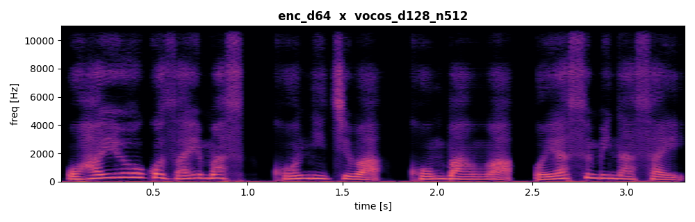](docs/wav/enc_d64__vocos_d128_n512.mp4) |  |  |
| **enc_d96** |  |  | [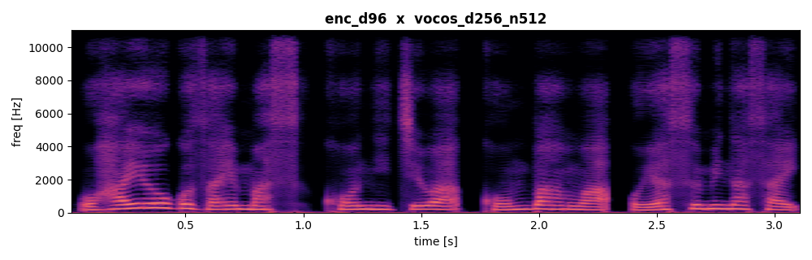](docs/wav/enc_d96__vocos_d256_n512.mp4) | [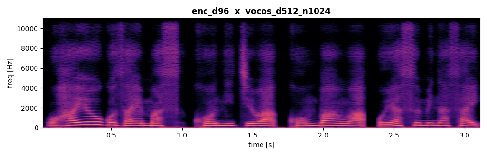](docs/wav/enc_d96__vocos_d512_n1024.mp4) |
| **enc_d128** |  |  | [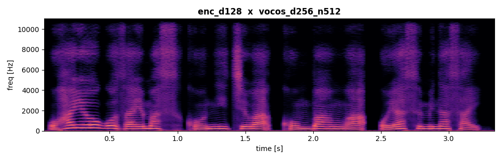](docs/wav/enc_d128__vocos_d256_n512.mp4) |  |
| **enc_d192** | [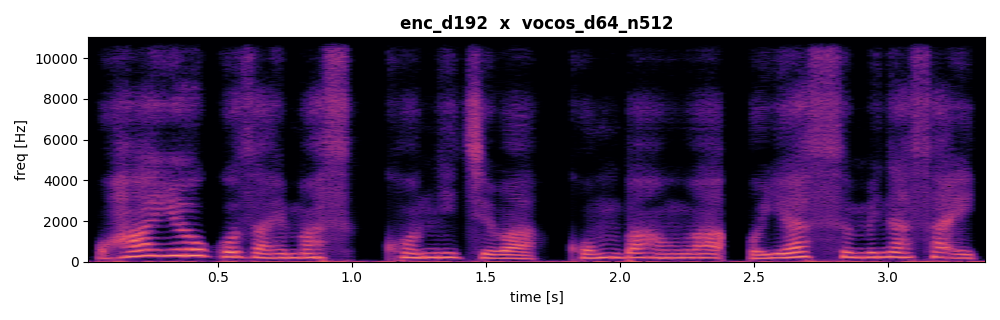](docs/wav/enc_d192__vocos_d64_n512.mp4) |  | [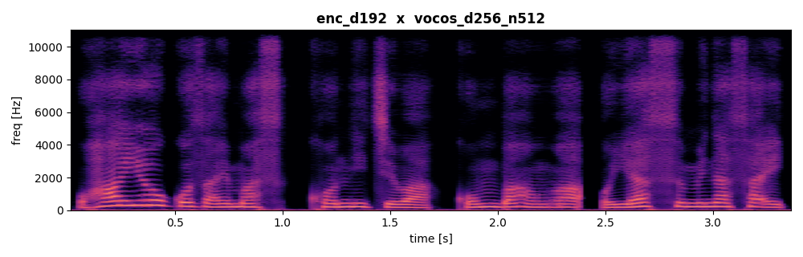](docs/wav/enc_d192__vocos_d256_n512.mp4) |  |
| **enc_d256** | [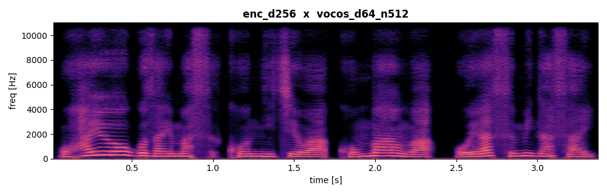](docs/wav/enc_d256__vocos_d64_n512.mp4) | [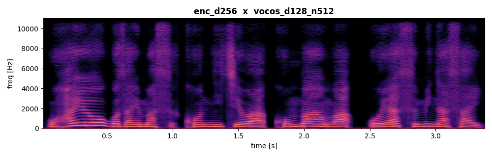](docs/wav/enc_d256__vocos_d128_n512.mp4) |  | [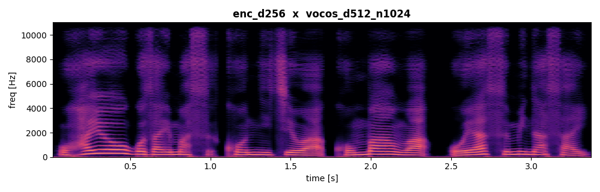](docs/wav/enc_d256__vocos_d512_n1024.mp4) |
| **enc_d384** | [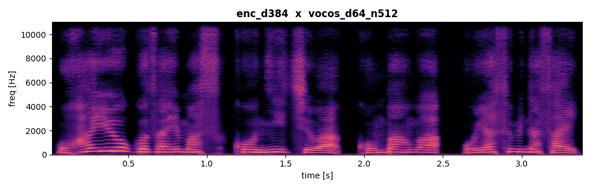](docs/wav/enc_d384__vocos_d64_n512.mp4) |  | [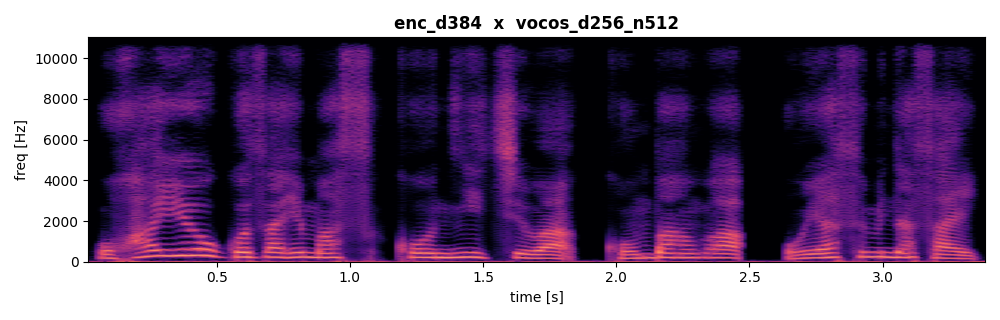](docs/wav/enc_d384__vocos_d256_n512.mp4) | [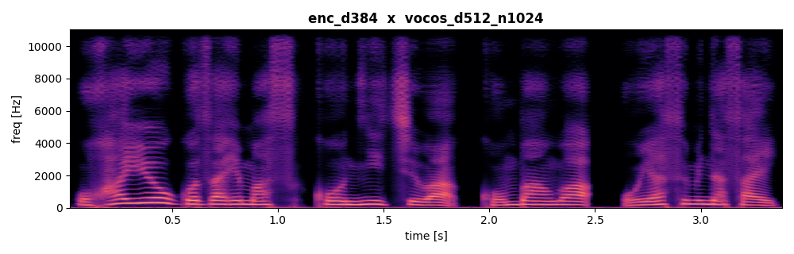](docs/wav/enc_d384__vocos_d512_n1024.mp4) |

